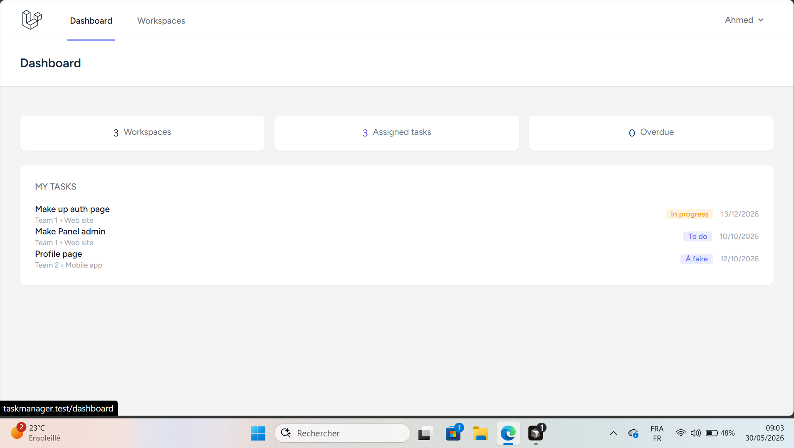
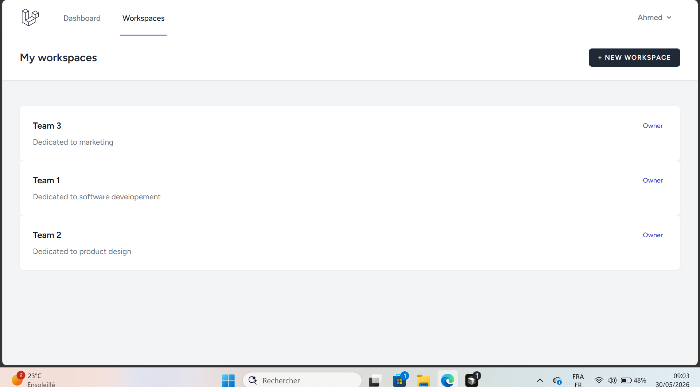
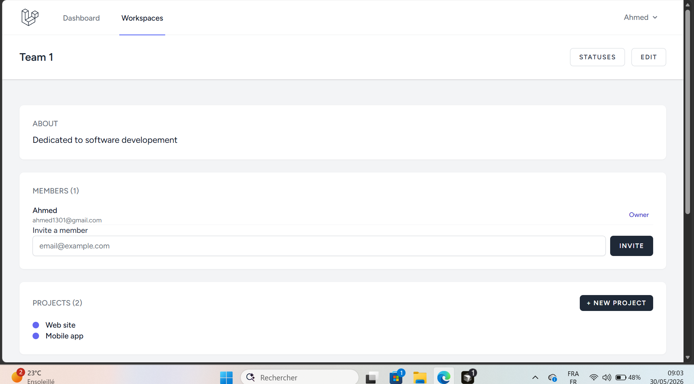
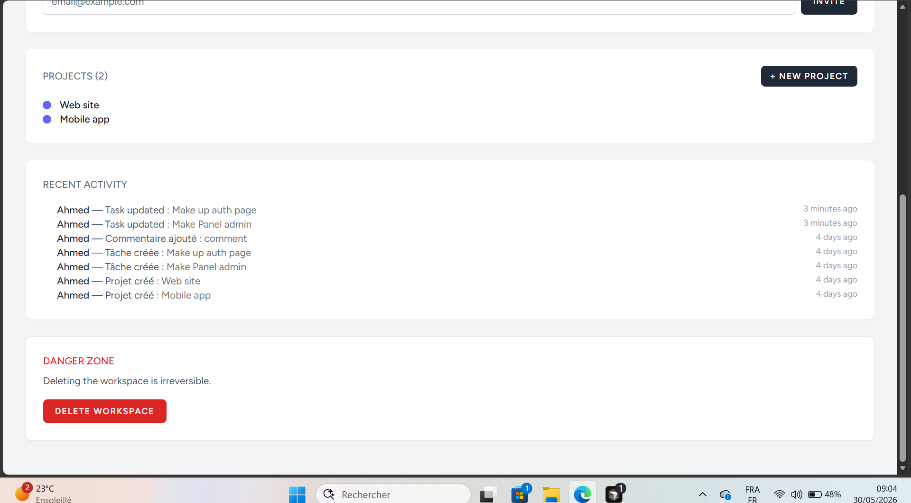
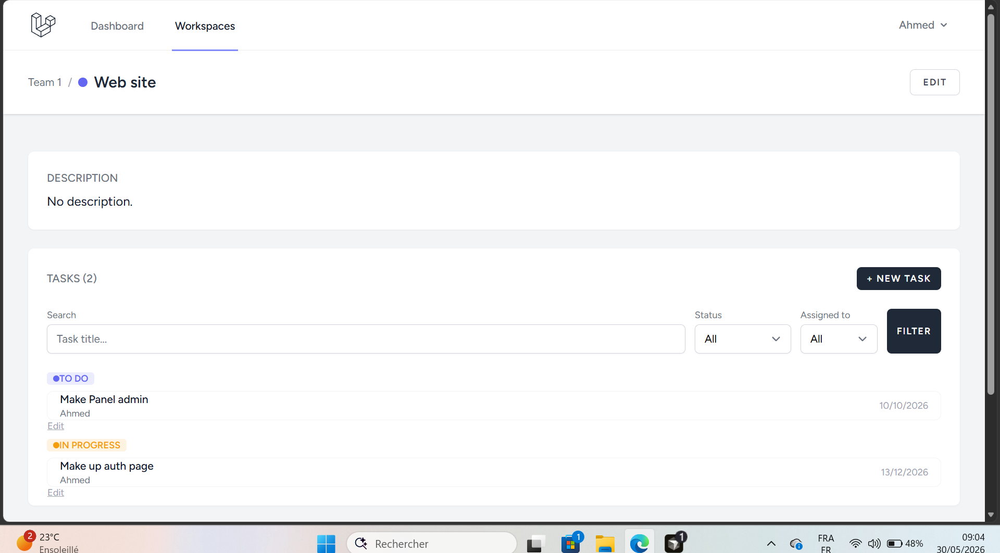
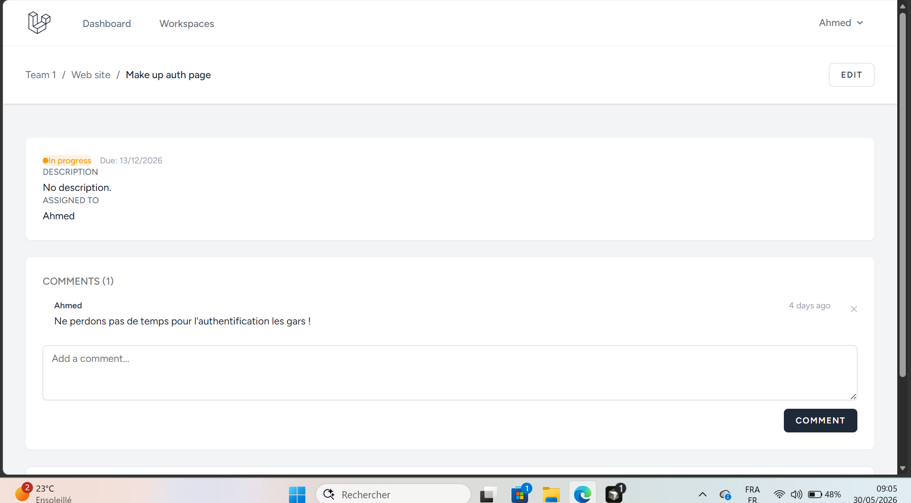
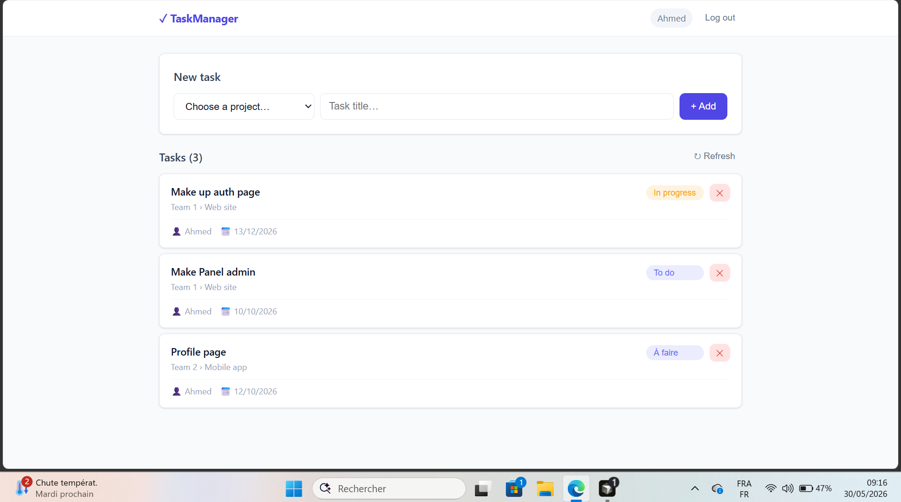
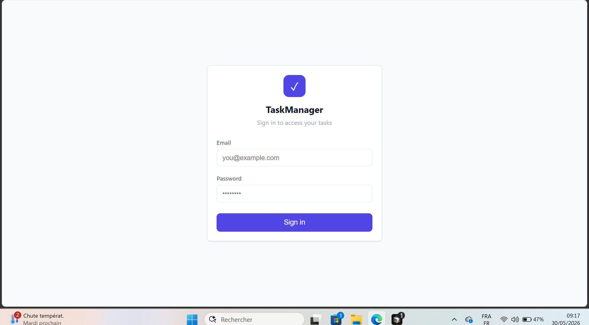

# TaskManager

)

)

)

)

)

> A full-featured collaborative task management platform inspired by **Trello** and **Linear**, built with Laravel.  

> Built progressively across 10 phases to demonstrate strong backend skills: auth, policies, services, REST API, MVC, and team-based permissions.

---

## Table of Contents

- [Features](#features)

- [Tech Stack](#tech-stack)

- [Requirements](#requirements)

- [Installation](#installation)

- [API](#api)

- [Screenshots](#screenshots)

- [License](#license)

---

## Features

| Phase | Feature | Highlights |

|---|---|---|

| 1 | **Authentication** | Register, login, logout, email verification, password reset |

| 2 | **Workspaces** | Owner + members, CRUD, policies, access control |

| 3 | **Projects** | Per workspace, color-coded, scoped bindings |

| 4 | **Tasks** | Title, description, due date, assignee, status — grouped by status |

| 5 | **Custom Statuses** | Configurable per workspace, default: To Do / In Progress / Done |

| 6 | **Comments** | Thread per task, author-only deletion |

| 7 | **Activity Log** | Auto-logging via Spatie, last 20 actions per workspace |

| 8 | **Dashboard & Filters** | Stats, assigned/overdue tasks, filters persisted in URL |

| 9 | **Member Invitations** | Invite by email, remove members, WorkspaceMemberService |

| 10 | **REST API** | Bearer token, CRUD projects & tasks, JSON Resources, pagination |

---

## Tech Stack

| Layer | Technology |

|---|---|

| Language | PHP 8.4 |

| Framework | Laravel 13.x |

| Authentication | Laravel Breeze 2.x + Sanctum 4.x |

| Database | SQLite (local) / MySQL (production) |

| Frontend | Blade + Vite |

| Activity Logs | Spatie Activitylog 5.x |

---

## Requirements

- PHP >= 8.4

- Composer

- Node.js >= 20

- SQLite (included with PHP)

---

## Installation

```bash

git clone [https://github.com/Ali-fyi/taskmanager.git](https://github.com/Ali-fyi/taskmanager.git)

cd taskmanager

composer install

npm install

cp .env.example .env

php artisan key:generate

touch database/database.sqlite

php artisan migrate --seed

# Two terminals

php artisan serve

npm run dev

```

Visit: [[http://localhost:8000](http://localhost:8000)](http://localhost:8000](http://localhost:8000))

---

## API

Authenticate via `POST /api/login` → returns a Bearer token.

```http

POST /api/login

{ "email": "[idris110@gmail.com](mailto:idris110@gmail.com)", "password": "jakjakwe3" }

→ { "token": "1|xxxxxxxx" }

```

Use `Authorization: Bearer {token}` on all subsequent requests.  

Endpoints available: `/api/projects` and `/api/tasks` (full CRUD, paginated).

---

## Screenshots

### Dashboard



### Workspaces



### Workspace Detail





### Project View



### Task View



### API





---

## License

MIT License — feel free to use and adapt.

---

## Project Structure

```

app/

├── Http/

│   ├── Controllers/        # Web + API controllers

│   ├── Requests/           # Form Requests (web + API)

│   └── Resources/          # JSON Resources (API)

├── Models/                 # Eloquent models

├── Policies/               # Authorization policies

└── Services/               # Business logic (WorkspaceMemberService)

database/

├── migrations/             # Database schema

└── seeders/                # Test data

routes/

├── web.php                 # Web routes

└── api.php                 # API routes